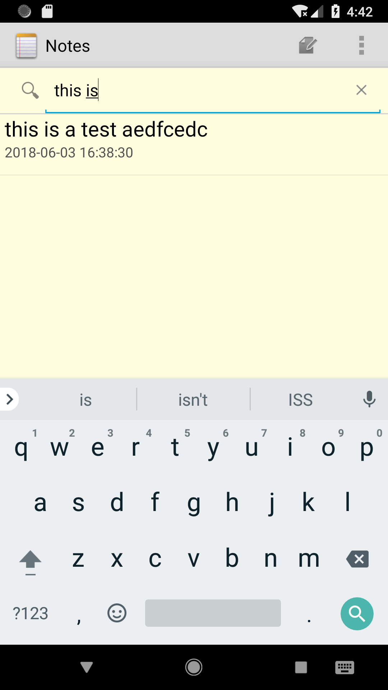
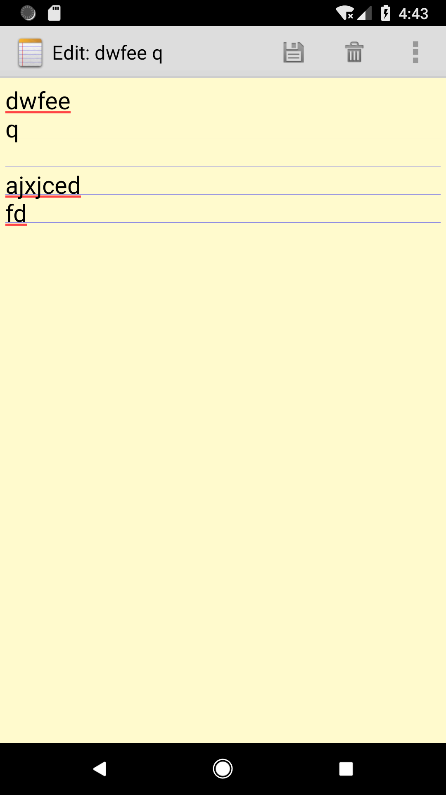

## 期中实验 NotePad  ##

#一：NoteList中显示条目增加时间戳显示#
**实现过程**

**1修改noteslist_item.xml中的样式<br>**
**2修改SimpleCursorAdapter的dataColumns和viewIDs的相关值<br>**
**3将Long转为String格式并显示<br>**

**部分代码展示<br>**

```
<LinearLayout xmlns:android="http://schemas.android.com/apk/res/android"
    android:layout_width="match_parent"
    android:layout_height="?android:attr/listPreferredItemHeight"
    android:orientation="vertical">

    <TextView xmlns:android="http://schemas.android.com/apk/res/android"
        android:id="@android:id/text1"
        android:layout_width="match_parent"
        android:layout_height="wrap_content"
        android:textAppearance="?android:attr/textAppearanceLarge"
        android:gravity="center_vertical"
        android:paddingLeft="5dip"
        android:singleLine="true"
    />
    <TextView xmlns:android="http://schemas.android.com/apk/res/android"
        android:id="@+id/time_text"
        android:layout_width="match_parent"
        android:layout_height="wrap_content"
        android:textAppearance="?android:attr/textAppearanceLarge"
        android:gravity="center_vertical"
        android:paddingLeft="5dip"
        android:textSize="15dp"
        android:textColor="@color/create"
        android:singleLine="true"
        />


</LinearLayout>
```

```
 String[] dataColumns = { NotePad.Notes.COLUMN_NAME_TITLE, NotePad.Notes.COLUMN_NAME_CREATE_DATE} ;     
 int[] viewIDs = { android.R.id.text1, R.id.time_text };

```

**效果截图**


#二：添加笔记查询功能（根据标题查询）#

**实现过程**

**1创建一个搜索框视图 添加SearchView<br>**
**2将变量与控件关联<br>**
**3设置点击搜索按钮时触发的方法和搜索内容改变时触发的方法<br>**
**部分代码展示<br>**

```
 msearch.setOnQueryTextListener(new SearchView.OnQueryTextListener() {
       
        @Override
        public boolean onQueryTextSubmit(String query) {
            return false;
        }

    
        @Override
        public boolean onQueryTextChange(String newText) {
            if (!TextUtils.isEmpty(newText)){

                Cursor cursor = managedQuery(
                        getIntent().getData(),            
                        PROJECTION,                      
                        NotePad.Notes.COLUMN_NAME_TITLE+ " LIKE '%"+newText+"%' ",                             
                        null,                             
                        NotePad.Notes.DEFAULT_SORT_ORDER 
                );
                final String[] dataColumn = { NotePad.Notes.COLUMN_NAME_CREATE_DATE, NotePad.Notes.COLUMN_NAME_TITLE } ;

                
                int[] viewID = {R.id.time_text,android.R.id.text1 };
                SimpleCursorAdapter adapter1
                        = new SimpleCursorAdapter(
                        NotesList.this,                            
                        R.layout.noteslist_item,        
                        cursor,                          
                        dataColumn,
                        viewID
                );
                
                setListAdapter(adapter1);
            }else{
              
                setListAdapter(adapter);
            }
            return false;
        }
    });

```

**效果截图**




#三：界面优化#
**实现过程**

**用style文件关联主题 改变背景颜色<br>**
**部分代码展示<br>**


**效果截图**

